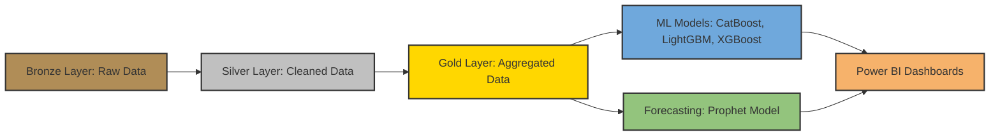

# 🚦 US Accident Analysis Project  

## 📌 Overview  
This project analyzes **US traffic accident data** using a **Medallion architecture pipeline** (Bronze → Silver → Gold), applies **machine learning models** for severity prediction, and leverages **forecasting techniques** to predict future accident trends. Finally, insights are visualized in **Power BI dashboards** for decision-making.  

---

## 🏗️ Architecture  
The project follows the **Medallion Architecture**:  

- **Bronze Layer**: Raw accident data ingestion.  
- **Silver Layer**: Cleaned and transformed data (handling missing values, duplicates, normalization).  
- **Gold Layer**: Aggregated and enriched datasets ready for ML and BI.  

## 🧩 Data Pipeline Diagram


## 🔍 Features  
- **Data Cleaning**: Handling missing values, duplicates, and outliers.  
- **Exploratory Analysis**: Accident trends by state, weather, time, and severity.  
- **Machine Learning**: Severity classification using CatBoost, XGBoost, and ensemble models.  
- **Forecasting**: Accident trend prediction with Prophet and ARIMA.  
- **Power BI Dashboards**: Interactive reports with filters (state, severity, weather).  

---

## ⚙️ Installation & Setup  
1. Clone the repository:  
   ```bash
   git clone https://github.com/MohammedElhefnawy/Analysis-of-US-accident.git
   cd Analysis-of-US-accident
## Install dependencies:
   pip install -r requirements.txt
   
---
   
## Run notebooks in order:
- **01_Bronze_Data_Preparation.ipynb**
- **02_Silver_Data_Cleaning.ipynb**
- **03_Gold_Data_Modeling.ipynb**
- **Road feature.ipynb**
- **US_Accidents_Final_Training_&_Dashboard.ipynb**
- **05_Prophet_Forecast.ipynb**
- **US_Accidents_Prediction_Service**

---

## 📊 Dashboards & Visuals
Accident heatmaps by state & city
Severity distribution across weather conditions
Forecasted accident trends with confidence intervals
Drill-down reports from national → state → city → road
📸 [Add screenshots of Power BI dashboards here]

---

## 📈 Results
CatBoost model achieved highest accuracy for severity classification.
Forecasting layer revealed seasonal accident peaks (winter months).
Power BI dashboards provide actionable insights for policymakers and insurance companies.

---

## 🚀 Future Improvements
Add Dockerfile for reproducibility.
Implement CI/CD pipeline with GitHub Actions.
Explore deep learning models (LSTM) for forecasting.
Enhance dashboard storytelling with executive summaries.

---

## 🤝 Contributing
Pull requests are welcome. For major changes, please open an issue first to discuss what you’d like to change.

---

## 📂 Dataset Source
The dataset used in this project is the **US Accidents (March 2023)** dataset, publicly available on [Kaggle](https://www.kaggle.com/datasets/joytuntonny/us-accidents-march23).  
It contains detailed records of traffic accidents across the United States, including information on location, time, weather, road features, and severity.

---

## 📜 License
This project is licensed under the **MIT License**.  
You are free to use, modify, and distribute the code with proper attribution.  
